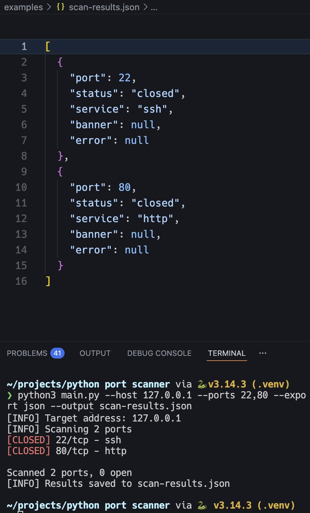
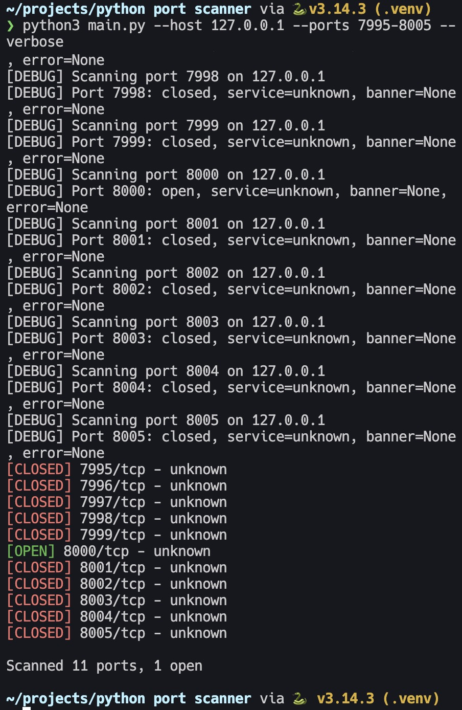

# Python TCP Port Scanner

A professional TCP port scanner with clean architecture, threaded scanning, and export support. This project is ideal for cybersecurity learners, pentest tool prototypes, and anyone who wants a reliable command-line scanner with JSON/TXT export.

## Features

- Scan a single host by IP or hostname
- Support for comma-separated ports and port ranges (for example: `22,80,443,8000-8100`)
- Configurable TCP timeout for accurate results
- Optional banner grabbing for open ports
- Built-in service identification for common ports
- Colored CLI output with optional `--no-color`
- Fast thread-based scanning with `--fast` and `--threads`
- JSON and TXT export of scan results
- Reliable error handling for invalid input and unresolved hosts
- Verbose logging mode for debugging and scan details

## Installation

```bash
git clone https://github.com/username/python-port-scanner.git
cd python-port-scanner
python3 -m venv .venv
source .venv/bin/activate
pip install -r requirements.txt
```

## Usage

```bash
python main.py --host scanme.nmap.org --ports 22,80,443 --timeout 1.5 --fast --banner --export json --output results.json
```

### CLI options

- `--host`: hostname or IP address to scan
- `--ports`: comma-separated ports and ranges, e.g. `22,80,443,8000-8100`
- `--timeout`: socket timeout in seconds
- `--banner`: enable optional banner grabbing for open ports
- `--fast`: enable threaded scanning
- `--threads`: number of worker threads when using fast scan mode
- `--export`: export format, either `json` or `txt`
- `--output`: export file path
- `--verbose`: enable debug logging
- `--no-color`: disable ANSI colors in output

### Examples

```bash
python main.py --host 127.0.0.1 --ports 1-1024 --timeout 1.0 --fast
python main.py --host example.com --ports 22,80,443 --banner --export txt --output scan.txt
python main.py --host 192.168.1.10 --ports 20-25 --verbose
python main.py --host 192.168.1.5 --ports 22,80,443 --export json --output ./results/scan.json
```

## Example output

```text
[INFO] Resolving host: example.com
[INFO] Target address: 93.184.216.34
[INFO] Scanning 3 ports
[OPEN] 22/tcp - ssh
[CLOSED] 80/tcp - http
[OPEN] 443/tcp - https

Scanned 3 ports: 2 open, 1 closed, 0 filtered, 0 with errors
[INFO] Results saved to results.json
```

## Export formats

- JSON export includes port, status, service, banner, and error details.
- TXT export lists one port per line with status, service, and optional banner/error data.

## Screenshots




## Project structure

```text
python-port-scanner/
├── README.md
├── requirements.txt
├── .gitignore
├── scanner/
│   ├── __init__.py
│   ├── scanner.py
│   ├── network.py
│   ├── banner.py
│   ├── output.py
│   └── utils.py
├── examples/
├── screenshots/
│   ├── scan-results.jpg
│   └── verbose-scan.jpg
└── main.py
```

## Notes

- Use scans only on hosts you own or have permission to test.
- A timeout error is treated as a filtered port and may indicate network filtering or packet loss.
- The scanner supports up to 1024 unique ports by default, but more can be scanned as needed.

## Changelog

See `CHANGELOG.md` for the full list of recent upgrades and release notes.

## Publishing to GitHub

1. Stage the updated files:
   ```bash
   git add README.md CHANGELOG.md main.py scanner/network.py scanner/scanner.py scanner/output.py scanner/utils.py
   ```

````
2. Commit with a descriptive message:
   ```bash
git commit -m "Document scanner upgrades and add changelog for CLI, export, timeout, and threading improvements"
````

3. Push the branch to GitHub:
   ```bash
   git push origin your-branch-name
   ```

```
4. Create a Pull Request or release on GitHub and use the changelog entries as release notes.
```
